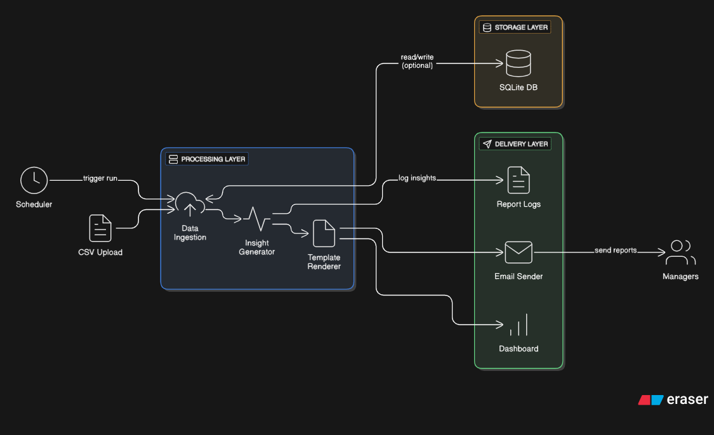
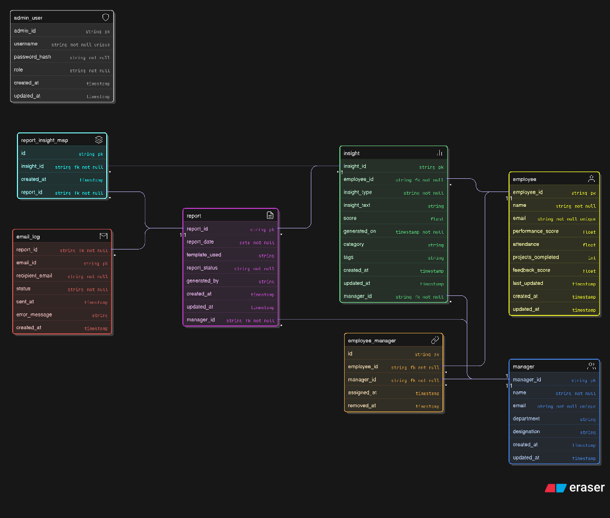

# 🚀 InsightFlow: Manager Intelligence Engine

InsightFlow is a backend system built using **FastAPI**, designed to generate automated people insights and send personalized email reports to managers. It's modular, scalable, and deployable on **Google Cloud Run**.

---

## 📘 Table of Contents

- [📚 Features](#-features)
- [🏗️ Architecture](#-architecture)
- [📦 Tech Stack](#-tech-stack)
- [📁 Project Structure](#-project-structure)
- [🚀 Getting Started](#-getting-started)
- [🐳 Docker & GCP Deployment](#-docker--gcp-deployment)
- [🧪 API Testing (Postman)](#-api-testing-postman)
- [🧬 ER Diagram](#-er-diagram)
- [📤 API Routes](#-api-routes)
- [🛡️ Security Notes](#️-security-notes)
- [🧑‍💻 Contributing](#-contributing)
- [📜 License](#-license)

---

## 📚 Features

- 📥 Upload employee-manager mapping via CSV
- 🤖 Automatically generate insights per employee
- 📄 Build reports and log them to the database
- 📧 Send templated emails to managers
- 🧾 Track email logs (sent, failed)
- ✅ CRUD APIs for employee management
- 🌍 Deployable on Google Cloud Run

---

## 🏗️ Architecture




---

## 📦 Tech Stack

| Layer        | Technology               |
|--------------|--------------------------|
| Backend      | FastAPI + Uvicorn        |
| Database     | PostgreSQL / SQLite      |
| ORM          | SQLAlchemy               |
| Emailing     | `smtplib` (SMTP)         |
| Cloud        | Google Cloud Run         |
| Container    | Docker                   |
| Task Queue   | APScheduler (for CRON)   |

---

## 📁 Project Structure

```bash
app/
├── main.py
├── models/
├── routers/
├── services/
├── templates/
├── database/
├── schemas/
├── scheduler/
└── utils/
```

---

## 🚀 Getting Started

### 🔧 1. Clone the Repository

```bash
git clone https://github.com/your-username/insightflow.git
cd insightflow
```

### 📦 2. Create and Activate Virtual Environment

```bash
python -m venv venv
source venv/bin/activate  # On Windows: venv\Scripts\activate
```

### 🧪 3. Install Dependencies

```bash
pip install -r requirements.txt
```

### 🛠️ 4. Run the App Locally

```bash
uvicorn app.main:app --reload
```

Visit docs at: [http://127.0.0.1:8000/docs](http://127.0.0.1:8000/docs)

---


## 🧪 API Testing (Postman)

You can import the Swagger `/docs` JSON, or use the hosted Postman collection below:

📦 [Click here to open Postman Collection](https://aj-5721126.postman.co/workspace/AJ's-Workspace~19fda9e6-6ed8-40b2-8290-019ebc77ca67/collection/45813818-8f8440de-1574-4df7-8b7b-442862e296d5?action=share&creator=45813818)

### Key API Endpoints:

- `POST /upload/employee-csv/` – Upload employee-manager mapping CSV
- `POST /report/generate/` – Generate insights and reports
- `POST /email/send/{report_id}` – Send email report
- `GET /email-logs/` – View email logs
- `GET /employee/` – List all employees

---

---

## 🧬 ER Diagram

> ✅ **Placeholder for ER Diagram**  
> _(Add your ER diagram image here: `/assets/er-diagram.png`)_



---

## 📤 API Routes

| Method | Endpoint                         | Description                       |
|--------|----------------------------------|-----------------------------------|
| POST   | /upload/employee-csv/            | Upload employee-manager CSV       |
| POST   | /report/generate/                | Generate insights and reports     |
| POST   | /email/send/{report_id}          | Send email for a report           |
| GET    | /email-logs/                     | Get all email logs                |
| GET    | /employee/                       | List all employees                |

---

## 🛡️ Security Notes

- Avoid storing SMTP credentials in source code.
- Use `.env` and GCP Secret Manager.
- Ensure CORS is configured securely for production.

---

## 🧑‍💻 Contributing

1. Fork the repo 🍴  
2. Create a new branch `git checkout -b feature-branch`  
3. Commit your changes `git commit -m 'Added new feature'`  
4. Push to the branch `git push origin feature-branch`  
5. Create a PR ✅

---

## 📜 License

Licensed under the [MIT License](LICENSE).

---

> 🔗 Built with ❤️ by Anshul Jain – For Angel One Internship
